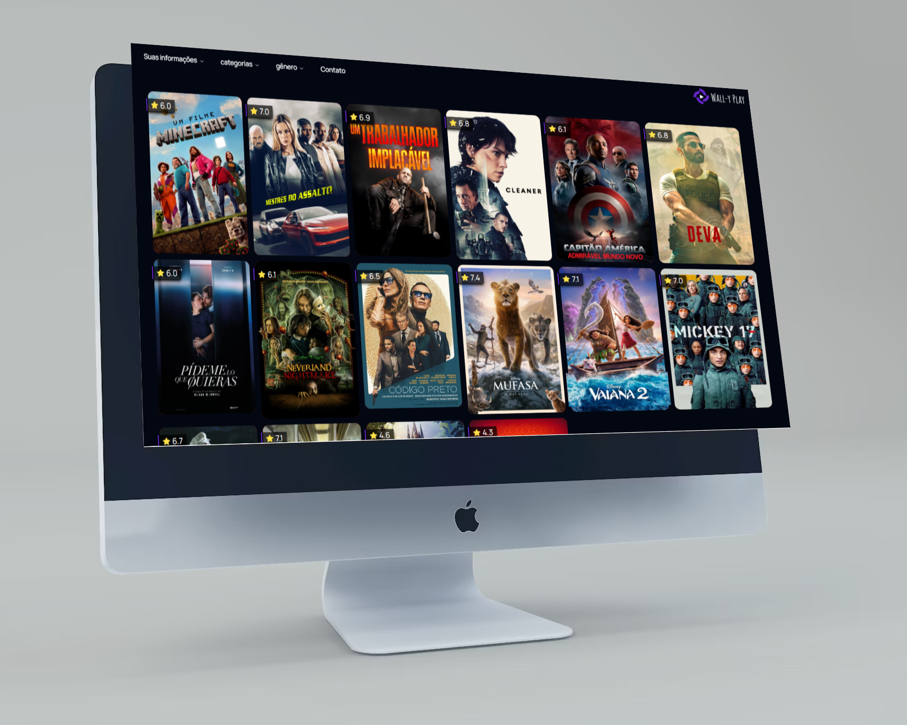

<h1 align="center">Projeto: Wall-Y Play</h1>

**Wall Y Play** é um projeto web dedicado aos amantes de cinema, que oferece uma experiência interativa e intuitiva para explorar, descobrir e assistir filmes. Com uma interface moderna e responsiva, os usuários podem navegar por uma vasta coleção de filmes, acessar informações detalhadas, avaliações e trailers.

<p align="center">
  <a href="#tecnologias">Tecnologias</a>&nbsp;&nbsp;&nbsp;|&nbsp;&nbsp;&nbsp;
  <a href="#contribuir-ou-clonar">Contribuir</a>&nbsp;&nbsp;&nbsp;|&nbsp;&nbsp;&nbsp;
  <a href="#contato">Contato</a>&nbsp;&nbsp;&nbsp;|&nbsp;&nbsp;&nbsp;
  <a href="#licença">Licença</a>
</p>

<br>

<p align="center">
  
</p>

## Tecnologias


## Contribuir ou clonar

Contribuições são sempre bem-vindas! Sinta-se livre para abrir um fork.

1. Clone o repositório:
   ```bash
   git clone https://github.com/walacecordeiro/wall-y-play.git
   ```

2. Navegue até o diretório do projeto:
   ```bash
   cd wall-y-play
   ```

3. Instale as dependências:
   ```bash
   npm install
   ```

4. **Configuração da Variável de Ambiente para Bearer Token do TMDB**:
   - Obtenha seu Bearer Token do [TMDB](https://www.themoviedb.org/).
   - Crie um arquivo `.env` na raiz do seu projeto e adicione a seguinte linha:
     ```plaintext
     AUTHORIZATION_TMDB=YOUR_TMDB_BEARER_TOKEN
     ```
   - Lembre-se de substituir `YOUR_TMDB_BEARER_TOKEN` pelo seu token real.

5. **Ignore o Arquivo `.env`**:
   - Certifique-se de que o arquivo `.env` esteja incluído no seu `.gitignore` para segurança.
    
6. **Para iniciar o aplicativo, utilize o comando**:
   ```bash
   npm run dev
   ```
O aplicativo estará disponível em [http://localhost:3000](http://localhost:3000).

## Contato

Para dúvidas ou sugestões, entre em contato:

- Email: walacecordeirodossantos@gmail.com
- LinkedIn: [walace-cordeiro-dos-santos](https://www.linkedin.com/in/walace-cordeiro-dos-santos/)

## Licença

Este projeto está licenciado sob a . Sinta-se à vontade para usar, modificar e distribuir este projeto.
